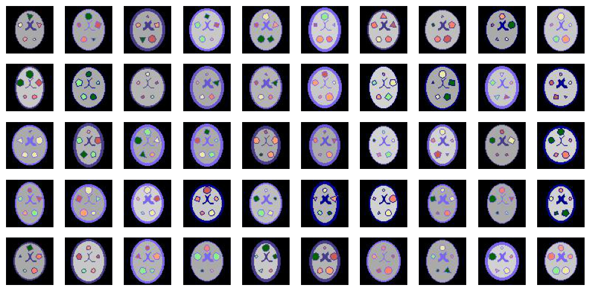
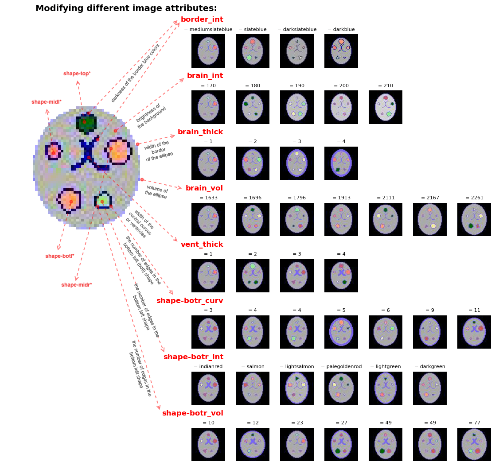
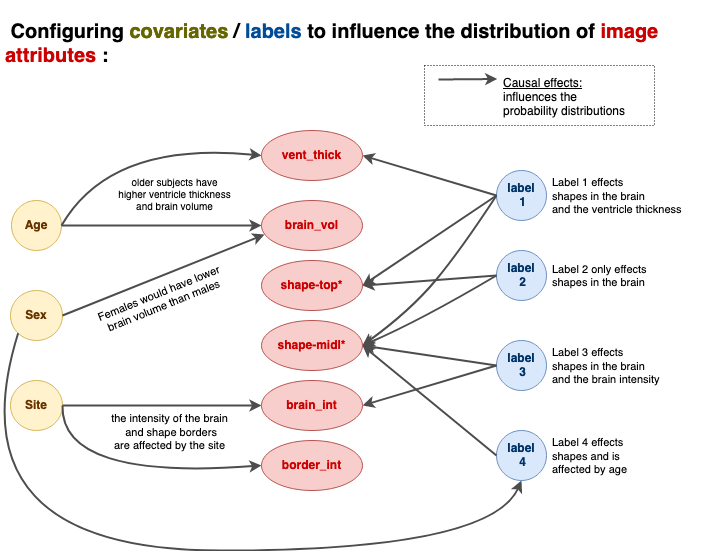

# Synthetic dataset: [Toybrains](https://github.com/RoshanRane/toybrains) 

## Introduction
_Figure 1: Examples of the 2D synthetic images generated with Toybrains_

Toybrains is a synthetic dataset of 2D images (see Figure 1) for training machine learning (ML) models for computer vision applications and intended for developing new mechanistic xAI (explainable AI) methods. The images have 64 x 64 pixels with 3 color channels and are loosely inspired by 2D brain MRI slices. The image have 16 tunable visual attributes such as the volume of different shapes, brightness, color, etc, as shown in Figure 2.
_Figure 2: How to tune and modify the different visual attributes of toybrain images_

The main strength of Toybrains over other existing synthetic image datasets, is the ability to define a causal generative graph that define how the distribution of the attributes would vary with respect to a output label, or other tertiary covariates, such as confounders or mediators. 
_Figure 3: Causal generative graph defines how the different visual attributes are influenced by the labels and other covariates, such as confounders_

Toybrains dataset provides a causal test bench with a **mathematically validated ground truth** to evaluate mechanistic xAI methods (refer to the [formal definition and proof page](docs/figures/formal_definition_and_proof.md)). Therefore with toybrains, ML researchers can create several dataset variations with different causal generative mechanisms and use this to validate the mechanistic xAI methods. 


## Getting started

1. Install the python package dependancies: Navigate into the directory of the repository. Then create a new enviroment called 'toy' using mamba (recommended) or conda and install all the dependencies.
```
mamba env create -f environment.yml
mamba activate toy
```
1. Go through the tutorials in the `tutorials` folder to create your first toybrains dataset. The master script for generating the dataset is `create_toybrains.py`.


<!-- ## Appendix
#### A1: Why are causal XAI methods important?
TODO
Causal XAI methods explain ML/DL model decisions in causal terms. That is, they detect whether a variable $c_k$ effects the model predictions $\hat{y}$ as a confounders, or a mediators and measures the effect of $c_k$ on generating $\hat{y}$. When DL models are used in scientific discovery (such as for brain-behaviour discovery using brain MRI), understanding the DL model decisions from a causal perspective becomes foremost important. -->


## Citation
If you use this code in your research or project, please consider citing the following:
([The codebase is published with Zenodo](https://doi.org/10.5281/zenodo.14509513)) <br>
BIBTEX:
```bibtex
@software{roshanrane_toybrains_2024,
  author       = {RoshanRane,
                  JiHoon Kim, Kerstin Ritter},
  title        = {RoshanRane/toybrains},
  month        = dec,
  year         = 2024,
  publisher    = {Zenodo},
  doi          = {10.5281/zenodo.14509512},
  url          = {https://doi.org/10.5281/zenodo.14509512},
}
```

APA-style:
```
RoshanRane, JiHoon Kim, & Kerstin Ritter. (2024). RoshanRane/toybrains. Zenodo. https://doi.org/10.5281/zenodo.14509512
```
