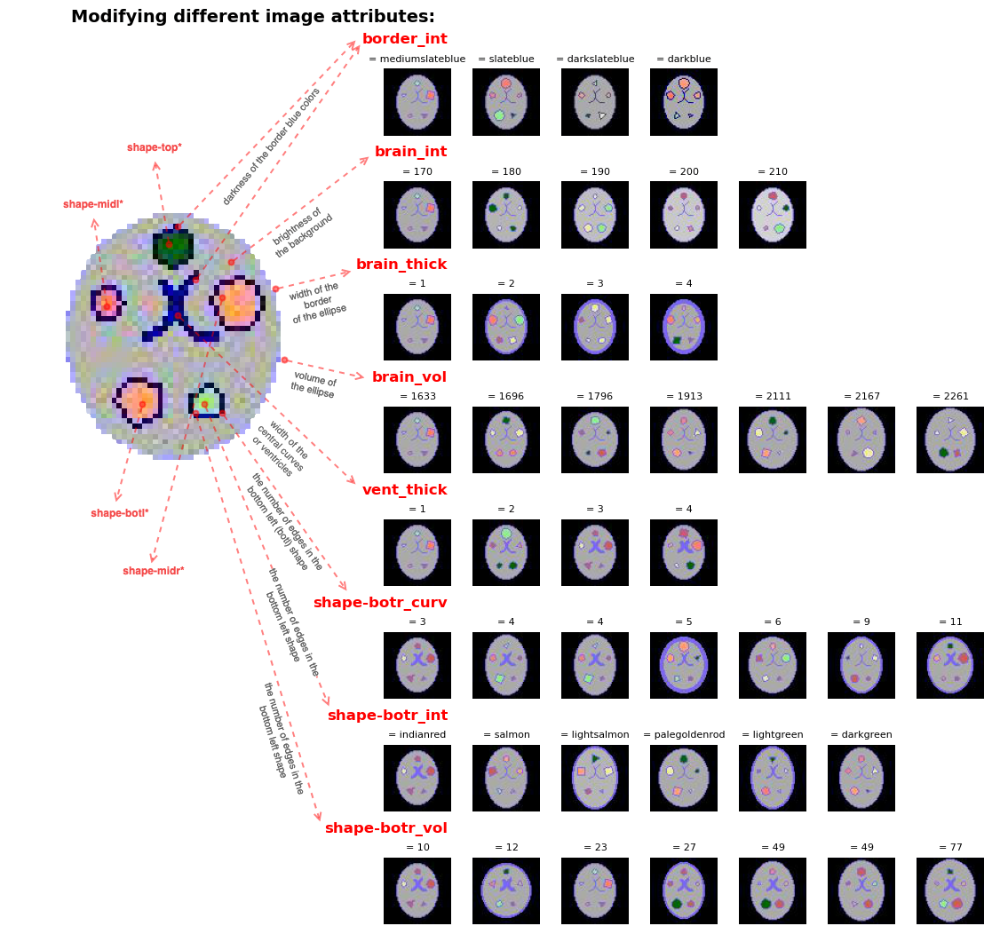

# [Toy Brains Dataset](https://github.com/RoshanRane/toybrains) 

The code can be used to generate a toy dataset of images (64 x 64 pixels) that roughly resemble 2D brain MRI slice.
The different attributes of the generated 2D images can be easily controlled and modified with any self-defined `labels` and `covariates` or confounders.  
The generated synthetic data can be used to quickly test and compare different confound-control methods analysis, or casuality analysis, and image-based prediction models such as deep learning architectures.

- The synthetic dataset can be generated using the [create_shapes_data.py](create_toybrains.py) script.
- The [How-to-use](docs/How-to-use.ipynb) notebook walks you through how one can create toybrain datasets and modify the relationship between the image generation attributes and any custom label or covariate.
- The [viz_gen_data_dists](viz_data_dists.ipynb) notebook shows how to quickly see the distribution of the generated data and what are the effects of the labels and covariates on the generated images. `inprogress`

## Image attributes that can be tuned:
