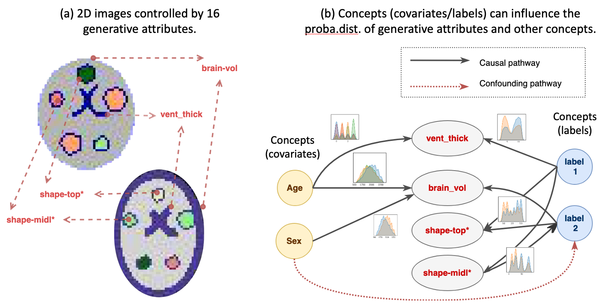

# Toybrains simulation dataset 
$\color{BrickRed}\text{Analysis timeline: July 2024 - Nov 2024}$

## Introduction :
* Toybrains is a synthetic dataset of 2D images that can be used to experiment with different machine learning (ML) models and understand what concepts they learn under different causal generative mechanisms.
* Latents: The images are generated by 16 image generation variables or 'latents' (refer [fig 1(a)](#fig1) and the [Toybrains ReadMe](https://github.com/RoshanRane/toybrains/blob/main/docs/toybrains.png) for more details). Each latent is treated as a multinomial random variable with an associated proba.dist (probabilty distribution) that can be modified by other external variables or 'concepts'.
* Concepts: Additionally, users can define any number of random variables or 'concept' that can influence the proba.dist of latents or each others. Each concept variable also has an associated proba.dist that can be modified by other concepts.  Refer to the schematic graph in [fig 1(b)](#fig1). In a ML experiment with a model $f_{\theta} : \textbf{X} \Rightarrow \textbf{y}$, the concepts can be labels $y$ or the mediators and confounders that drive the relationship $\textbf{X} \leftrightarrow \textbf{y}$, in other words $P(\textbf{y}|\textbf{X})$. How different concepts influence the proba.dist of the latents and other concepts are defined by a generative causal graph (a Python dictionary).
_Figure 1: Data generation process of Toybrains._
* Test datasets: The Toybrains dataset allows users to validate ML models $f_{\theta} : \textbf{X} \Rightarrow \textbf{y}$ by determining if it learns the correct concepts influence the relationship between the images $\textbf{X}$ and the label $y$ in the dataset. It can be used to understand how different causal pathways (such as confounders $\textbf{X} \leftarrow \textbf{c}_k \rightarrow y$ and mediators $\textbf{X} \rightarrow \textbf{c}_k \rightarrow y$) can effect prediction performance. This is achieved by validation the ML models on counterfactual test datasets generated by Toybrains. For every concept configured in the dataset, Toybrains generates a counterfactual test dataset where the effects of the concept is disabled by disabling all its edges in the generative graph. 

### Definitions:
> **Notation:** 
> * If $\textbf{X}$ is a matrix of shape $n_{obs} \times n_{f}$ then 
   >> 1. $x_{ij} = \textbf{X}[i,j]$ is the scalar value in the matrix at row (sample dimension) $i$  and column (feature dimension) $j$. $i$ is always used to denote the samples and $j,k,l,m, \ldots$ are used to denote the feature dimension of different matrices.
   >> 2. $\textbf{x}_j = \{\textbf{X}[1,j], \textbf{X}[2,j], \ldots, \textbf{X}[n_{obs},j]\}$ refers to the vector of all samples at column (feature dimension) $j$. 
   >> 1. Superscripts $\textbf{X}^a \subset \textbf{X}$ refers to a subset of the larger matrix $\textbf{X}$ along the samples dimension $i$. Similarly also for vectors, $\textbf{x}_j^{a} \subset \textbf{x}_j$.
> * Random variables are denoted as $X$ irrespective of if they are matrix or vector or scalars.
> * mathcal formating such as $\mathcal{R}$ are used special sets, spaces, or structures. 
> * Generative causal links are represented as $\overset{\beta}\leftarrow$ and $\overset{\gamma}\rightarrow$ where $\beta$ and $\gamma$ are the effect sizes.
> * A model with parameters $\theta$ is denoted as $f_{\theta}$ and applying the model on a data $\{\textbf{X}, \textbf{y}\}$ is denoted as $f_{\theta}:\textbf{X}\Rightarrow \textbf{y}$ and the model's estimation of $\textbf{y}$ are denoted by $\hat{\textbf{y}}$.

A Toybrains dataset $\mathcal{D}$ consists of 3 components:
* (a) Datapoints $\mathcal{D} = \{\mathcal{D}_1 \mathcal{D}_2, \ldots, \mathcal{D}_{n_{obs}}\}$ that are described by 4 vectors $\{\textbf{X},y,L,\textbf{C}\}$ of length $n_{obs}$ each.
* (b) The generative graph $\mathcal{G}$.
* (c) Counterfactual test datasets $\{\mathcal{D}^{test-c_i}, \ldots, \mathcal{D}^{test-c_j}\}$.
   

#### (a) Datapoints:

All the datapoint are described by 4 components $\mathcal{D} = \{\textbf{X},\textbf{y},\textbf{L},\textbf{C}\}$:
1. $\textbf{X} \in \mathbb{R}^{64 \times 64 \times n_{obs}}$ are the 2D images.
2. $\textbf{L} =\{\textbf{l}_1, \textbf{l}_2, \ldots ,\textbf{l}_{16}\},   \forall l_i | (l_i \in \mathbb{R}^{ n_{obs}}) \lor (l_i \in \mathbb{Z}_n^{n_{obs}})$ are the latent generative variables used that define the generate the image $\textbf{X}$. The 16 latents $\textbf{L}$ define different parts of the Toybrain such as the volume & color of the different shapes, the brightness of the whole brain shape, and so on. For more details refer to the [Toybrains ReadMe](https://github.com/RoshanRane/toybrains/blob/main/docs/toybrains.png).
3. $\textbf{y} \in \mathbb{Z}_2$ is the output label.
4. $\textbf{C}  =\{\textbf{c}_1, \textbf{c}_2, \ldots ,\textbf{c}_{100}\} ,   \forall \textbf{c}_k | (\textbf{c}_k \in \mathbb{R}^{ n_{obs}}) \lor (\textbf{c}_k \in \mathbb{Z}_2^{n_{obs}}) \lor (\textbf{c}_k \in \mathbb{Z}_n^{n_{obs}})$ are other covariates with mixed datatypes that influence the data generation process.

ML models that shall be investigated are always trained on the images $\textbf{X}$ to predict the binary label $\textbf{y}$. Therefore, they estimate $P(\textbf{y}|\textbf{X})$ where $X = g(\textbf{L})$.

Each variable in $\{\textbf{L},\textbf{y},\textbf{C}\}$ have an associated proba.dist $P(v)$. By default, these variables have a uniform distribution $P(v) = \frac{1}{|v|} , \forall v \in \{\textbf{L},\textbf{y},\textbf{C}\}$.

#### (b) The generative graph $\mathcal{G}$:
The data generation process is defined by the generative graph $\mathcal{G}$. That is, the probability dist. of variables $\{\textbf{L},\textbf{y},\textbf{C}\}$ can be influenced by other variables in $\{\textbf{L},\textbf{y},\textbf{C}\}$ and these relationships are defined by the graph $\mathcal{G}$. 

Currently in Toybrains, $\mathcal{G}$ can have 3 types of relationships $\alpha$, $\beta$ and $\gamma$ :
1. A covariate $\textbf{c}_k$ can influence a latent with an effect size $\alpha_k$:
   - $\textbf{C}^l = \{\textbf{c}_k \in \textbf{C} \mid \textbf{c}_k \overset{\alpha_k}\rightarrow l_j\}$
2. A latent $l_j$ can influence the output label with an effect size $\beta_j$:
   - $\textbf{L}^y = \{l_j \in \textbf{L} \mid l_j \overset{\beta_j}\rightarrow \textbf{y}\}$
   - We can call these the 'direct' effect of $\textbf{L}$ on $\textbf{y}$. For most experimental use cases, it is enough to have just one direct effect $|\textbf{L}^y|=1$.
3. A covariate $\textbf{c}_k$ can influence the output label with an effect size $\gamma_k$: 
   - $\textbf{C}^y = \{\textbf{c}_k \in \textbf{C} \mid \textbf{c}_k \overset{\gamma_k}\rightarrow \textbf{y}\}$

Therefore, $\mathbb{G} = \{ \textbf{c}_k \overset{\alpha_k}\rightarrow l_s | \forall \textbf{c}_k \in \textbf{C}^l\} \cup \{l_j \overset{\beta_j}\rightarrow \textbf{y} | \forall l_y \in \textbf{L}^y\} \cup \{c_i \overset{\gamma_i}\rightarrow \textbf{y} | \forall c_i \in \textbf{C}^y\}$.

Additionally, the covariates that are both $\textbf{C}^l$ and $\textbf{C}^y$ are called confounders:
- $\textbf{C}^{con} = \{\textbf{c}_k \in \textbf{C}^l \cap \textbf{C}^y \mid l_j \overset{\alpha_k}\leftarrow \textbf{c}_k \overset{\gamma_k}\rightarrow \textbf{y}\}$. 

Only the subset of covariates that are confounders influence the $P(y|\textbf{X})$ that would be estimated by the ML models.

##### How do the effects $\alpha, \beta, \gamma$ translate to probability?
Consider a simple example, in which $\mathcal{G}$ has one direct effect $\textbf{l}_1 \overset{\beta_1}\rightarrow \textbf{y}$ and only one confounder $\textbf{l}_5 \overset{\alpha_9}\leftarrow  \textbf{c}_9  \overset{\gamma_9}\rightarrow \textbf{y}$. Then the proba.dist. of the various variables in $\{\textbf{L},\textbf{y},\textbf{C}\}$ are:
1. The direct effect influences $\textbf{l}_5$ by changing the probability of sampling a particular state $s_i$ of $\textbf{l}_5$. This is encoded with a sigmoid as $P(\textbf{l}_5\texttt{=}s_i) = \text{sigm}(\alpha_9 . \textbf{c}_9) = \frac{e^{(\alpha_9 . \textbf{c}_9)}}{1+ e^{(\alpha_9 . \textbf{c}_9)}}$. For all other states the proba.dist is computed such that they together sum to $1 - P(\textbf{l}_5\texttt{=}s_i) = \frac{1}{1+ e^{(\alpha_9 . \textbf{c}_9)}}$. Therefore, $P(\textbf{l}_5\ne s_i) = \frac{\frac{1}{|\textbf{l}_5|-1}}{1 + e^{(\alpha_9 . \textbf{c}_9)}}$.
2. The proba.dist of the label $\textbf{y}$ is influenced by both the direct effect as well as the confounder-driven effects. This is encoded as $P(\textbf{y}\texttt{=}1) = \text{sigm}(\beta_1 . \textbf{l}_1 + \gamma_9 . \textbf{c}_9) = \frac{e^{(\beta_1 . \textbf{l}_1 + \gamma_9 . \textbf{c}_9)}}{1+ e^{(\beta_1 . \textbf{l}_1 + \gamma_9 . \textbf{c}_9)}}$ 
3. For all the other latents $\forall l_j \ne \textbf{l}_5$, they are sampled from a uniform distribution over their states $s_i$. That is, $P(l_j\texttt{=}s_i) = \frac{1}{|l_j|} \forall s_i$.
4. Similarly  $\forall \textbf{c}_k \ne \textbf{c}_9$, $P(\textbf{c}_k\texttt{=}s_i) =\frac{1}{|\textbf{c}_k|}  \forall s_i$.

#### (c) Training, test, & counterfactual test data subsets: 
A dataset $\mathcal{D}$ consists of:
1. One training and one test data subset $\{\mathcal{D}^{\text{train}}, \mathcal{D}^{\text{test}}\}$,
2. And $(|\textbf{L}^y|+ |\textbf{C}^{con}| + 1)$ counterfactual test data subsets $\{\mathcal{D}^{\text{test}\setminus l_j}, \mathcal{D}^{\text{test}\setminus \textbf{c}_k}, \ldots \mathcal{D}^{\text{test}\setminus c_l}, \mathcal{D}^{\text{test}\varnothing}\}$.

First, we sample the training datasplit $\mathcal{D}^{\text{train}}$ with e.g. $n_{obs} = 5000$ and the independant test datasplit $\mathcal{D}^{\text{test}}$ with e.g. $n_{obs} = 500$ after applying all the effects defined in the generative graph $\mathcal{G}$.

To counterfactual test datasets are generated from $\mathcal{D}^{\text{test}}$ by taking each sample and disabling one of the nodes in $\mathcal{G}$. Therefore, they have the same $n_{obs}$ as $\mathcal{D}^{\text{test}}$.
1. $\mathcal{D}^{\text{test}\setminus l_j}$ are counterfactual test datasets for measuring the direct effects of $\forall l_j \in \textbf{L}^y$. These test datasets are generated by setting the effects of the edge $l_y$ to zero ($\beta_j = 0$). That is, the edge $\{l_j \overset{\beta_j}\rightarrow \textbf{y}\}$ is removed from $\mathcal{G}$. 
2. $\mathcal{D}^{\text{test}\setminus \textbf{c}_k}$ are counterfactual test datasets for measuring the confounder effects from $\forall \textbf{c}_k \in \textbf{C}^{con}$. These test datasets are generated by setting the effects of the edge $\textbf{c}_k$ to zero ($\alpha_k = 0$ and $\gamma_k=0$). That is, the edges $l_j \overset{\alpha_k}\leftarrow \textbf{c}_k \overset{\gamma_k}\rightarrow \textbf{y}$ are removed from $\mathcal{G}$.
3. ${D}^{\text{test}\varnothing}$: One 'test$\varnothing$' dataset sampled with all edges disabled in $\mathcal{G}$. That is  $\beta_j = 0$, $\gamma_k = 0$, $\alpha_k =0$ $\forall i,k$. <!--  TODO: still relavant for directions? -->

## Goal: 

Toybrains simulation dataset should provide a controlled setup for validating mechanistic xAI methods (also called Concept-based global explainability ex: TCAV) used to explain DL models performing binary classification. This would involve the following steps: 
1. The researcher configures the causal relationship between the Toybrain images $\textbf{X}$, the output label $\textbf{y}$, and a set of observable covariates $\{ \textbf{c}_k | \forall \textbf{c}_k \in \textbf{C}^{con}\}$ and latents $\{\textbf{l}_j | \forall \textbf{l}_j \in \textbf{L}^y\}$, using the graph $\mathcal{G}$. For example, the researcher can define a two pathways: (a) a direct causal pathway $\textbf{l}_j \rightarrow \textbf{X} \rightarrow \textbf{y}$ and (b) an indirect pathway $\textbf{X} \leftarrow \textbf{L} \leftarrow \textbf{c}_k \rightarrow \textbf{y}$.  
2. Toybrains dataset $\mathcal{D}^{\text{train}}$ and $\mathcal{D}^{\text{test}}$ are generated using the configured graph $\mathcal{G}$. 
3. ML models are trained on $\mathcal{D}^{\text{train}}$ to predict the binary label $f_{\theta}: \textbf{X} \Rightarrow \textbf{y}$. 
   1. The ML model is expected to estimate $P(\textbf{y}|\textbf{X})$, where $\textbf{X} = g(L)$.
   2. The model estimates $P(\hat{\textbf{y}}|\textbf{X})$, where $\hat{\textbf{y}}$ is the model's prediction of $y$. A measure of the difference $\mathbb{E} (P(\textbf{y}|\textbf{X})) - \mathbb{E} (P(\hat{\textbf{y}}|\textbf{X}))$ gives us the error in the model's estimation. This can be quantifies using metrics such as accuracy and explained deviance.
4. Now, the researcher would want to know two things:
   1. The exact configured effect sizes of the covariates in $\textbf{L}^y$ and $\textbf{C}^{con}$ in the generation of $P(\textbf{y}|\textbf{X})$. More precisely, if we describe $P(\textbf{y}|\textbf{X}) = \text{sigm}({\beta}_j . \textbf{l}_j + {\delta}_k. \textbf{c}_k)$, what would be ${\beta}_j$ and $\textbf{l}_j$ ?
   2. The effect sizes estimated by the ML model $P(\hat{\textbf{y}}|\textbf{X}) = f(\hat{\beta}_j . \textbf{l}_j + \hat{\delta}_k. \textbf{c}_k)$.

Ideally, the exact configured effect sizes $\beta$ and $\delta$ (point 4(i) above) must be deductable as we have access to the entire generative process of the Toybrains. However, 2 complications arise: 
1. The effect of a confounder $\textbf{c}_k$ on $P(\hat{\textbf{y}}|\textbf{X})$ is mediated by another random variable from $\textbf{L}$  say $\textbf{l}_p$.  Recall $P(\textbf{l}_p\texttt{=}s_r) = \text{sigm}(\alpha_k . \textbf{c}_k)$ and $\underset{{\forall s_n \ne s_r}}\sum P(\textbf{l}_p\texttt{=}s_n) = 1$, we can substitute $\textbf{l}_p$ as a non-linear transform $g_p(\alpha_k .\textbf{c}_k)$. Hence $\delta_k$ is an approximation such that $\delta_k.\textbf{c}_k \approx \gamma_k.g_p(\alpha_k .\textbf{c}_k)$, and analytically deriving $\delta_k$ is not straightforward.
2. The transformation of $L$ to $X$ is another high dimensional and non-linear transform. For example, a latent $l_5$ can transform into 3 values of several pixels in $X$. 
**The main mathematical question is how to use counterfactual test datasets to quantify these configured effects and the learned effects of the covariates on model predictions?**

Therefore, the question is can we use the counterfactual test datasets $\{\mathcal{D}^{\text{test}\setminus l_j}, \mathcal{D}^{\text{test}\setminus \textbf{c}_k}, \ldots\}$ to derive .......

## Research Question

**Condition:**
The ML model's predictions on $\mathcal{D}^{\text{test}}$, $\hat{\textbf{y}}$, is generated by the model with $P(\hat{\textbf{y}}) = \text{sigm}(\hat{\beta_j}.l_j + \hat{\gamma_k}. l_k + \ldots)$, where $\hat{\beta_j}, \hat{\gamma_k}, \ldots$ are the model's estimation of the $\beta_j, \gamma_k, \ldots$ resp.
In the ML experiments, we will have access to $\{\textbf{X},\textbf{y},\textbf{C}, \textbf{L}, f_{\theta}\}$, but not the model's estimation of $\hat{\beta_j}, \hat{\gamma_k}$. We neither have access to the transform $\textbf{X} = g(\textbf{L})$. 
**Idea:**
We can test the model $f_{\theta}$ on $\{\mathcal{D}^{\text{test}}, \mathcal{D}^{\text{test}\setminus l_j}, \mathcal{D}^{\text{test}\setminus \textbf{c}_k}, \ldots\}$, obtain $\{\hat{\textbf{y}}, \hat{\textbf{y}}^{\text{test}\setminus l_j}, \hat{\textbf{y}}^{\text{test}\setminus \textbf{c}_k}, \ldots\}$ resp. and using this deduce the $\hat{\beta_j}, \hat{\gamma_k}$.

The model predictions on $\mathcal{D}^{\text{test}\setminus l_j}$ is $\hat{\textbf{y}}^{\text{test}\setminus l_j}$.
The model predictions on $\mathcal{D}^{\text{test}\setminus \textbf{c}_k}$ is $\hat{\textbf{y}}^{\text{test}\setminus \textbf{c}_k}$.
and so on $\ldots$

Let us reformulate our research question with the help of the above definitions:
**If we train a ML model $f_{\theta}: \textbf{X} \Rightarrow \textbf{y}$ on the $\mathcal{D}^{\text{train}}$, can we use the counterfactual test data $\{\mathcal{D}^{\text{test}\setminus l_j}, \mathcal{D}^{\text{test}\setminus \textbf{c}_k}, \ldots\}$  to estimate the exact effects produced by the covariates $\{l_j, \textbf{c}_k, \ldots\}$ on the model predictions $P(\hat{\textbf{y}}|\textbf{X})$?**

## Proof: 

#### Consider a simple dataset:

Let us also consider that the Toybrains dataset was generated using a simple $\mathcal{G}$ with one direct effect $\textbf{L}^y=\{\textbf{l}_1\}$ such that, $\textbf{l}_1 \overset{\beta_1}\rightarrow \textbf{y}$ and two confounders $\textbf{C}^{con}=\{\textbf{c}_9, \textbf{c}_{25}\}$ that influence the latents  $\textbf{l}_5$ and $\textbf{l}_{15}$ respectively. That is $\textbf{l}_5 \overset{\alpha_9}\leftarrow \textbf{c}_9 \overset{\gamma_9}\rightarrow \textbf{y}$ and $\textbf{l}_{15} \overset{\alpha_{25}}\leftarrow \textbf{c}_{25} \overset{\gamma_{25}}\rightarrow \textbf{y}$.

The true proba.dist of $\textbf{y}\texttt{=}1$ in $\mathcal{D}^{\text{test}}$ &  $\mathcal{D}^{\text{train}}$ is then,
$P(\textbf{y}) = \text{sigm}(\beta_1 . \textbf{l}_1 +  \gamma_9 . \textbf{l}_5 + \gamma_{25} . \textbf{l}_{15})$

Substituting for both $\textbf{c}_9$ and $\textbf{c}_{25}$,
$P(\textbf{y}) = \text{sigm}(\beta_1 . \textbf{l}_1 +  \gamma_9 . g_5(\alpha_9 . \textbf{c}_9) +  \gamma_{25} . g_{15}(\alpha_{25} . \textbf{c}_{25}))$
Applying the logit transform (inverse sigmoid = $ \log \frac{p}{1-p}$) on both sides,
$$\text{logit}(P(\textbf{y})) = \underbrace{\beta_1 . \textbf{l}_1}_{\text{direct eff. }\textbf{l}_1} +  \underbrace{\gamma_9 . g_5(\alpha_9 . \textbf{c}_9)}_{\text{conf. eff. }\textbf{c}_9} + \underbrace{\gamma_{25} . g_{15}(\alpha_{25} . \textbf{c}_{25})}_{\text{conf. eff. }\textbf{c}_{25}}$$

<!-- Mention the assumption: c and l are N(0,1) dist. -->
The counterfactual test dataset $\mathcal{D}^{\text{test}\setminus \textbf{l}_1}$ is generated after forcing $\beta_1=0$. Thus in $\mathcal{D}^{\text{test}\setminus \textbf{l}_1}$, The logit of the proba.dist is
$$\text{logit}(P(\textbf{y}^{\text{test}\setminus \textbf{l}_1})) = \underbrace{\gamma_9 . g_5(\alpha_9 . \textbf{c}_9^{\text{test}\setminus \textbf{l}_1})}_{\text{conf. eff. }\textbf{c}_9} + \underbrace{\gamma_{25} . g_{15}(\alpha_{25} . \textbf{c}_{25}^{\text{test}\setminus \textbf{l}_1})}_{\text{conf. eff. }\textbf{c}_{25}}$$
Similarly, for $\mathcal{D}^{\text{test}\setminus \textbf{c}_9}$,
$$\text{logit}(P(\textbf{y}^{\text{test}\setminus \textbf{c}_9})) = \underbrace{\beta_1 . \textbf{l}_1^{\text{test}\setminus \textbf{c}_9}}_{\text{direct eff. }\textbf{l}_1} + \underbrace{\gamma_{25} . g_{15}(\alpha_{25} . \textbf{c}_{25}^{\text{test}\setminus \textbf{c}_9})}_{\text{conf. eff. }\textbf{c}_{25}}$$

and for $\mathcal{D}^{\text{test}\setminus \textbf{c}_{25}}$,
$$\text{logit}(P(\textbf{y}^{\text{test}\setminus \textbf{c}_{25}})) = \underbrace{\beta_1 . \textbf{l}_1^{\text{test}\setminus \textbf{c}_{25}}}_{\text{direct eff. }\textbf{l}_1} + \underbrace{\gamma_9 . g(\alpha_9 . \textbf{c}_9^{\text{test}\setminus \textbf{c}_{25}})}_{\text{conf. eff. }\textbf{c}_9}$$

Now, if we subtract the logodds of $\mathcal{D}^{\text{test}}$ and the logodds of a counterfactual test data, say $\mathcal{D}^{\text{test}\setminus \textbf{c}_9}$
$\text{logit}(P(\textbf{y})) - \text{logit}(P(\textbf{y}^{\text{test}\setminus \textbf{c}_9}))$
$= (\beta_1 . \textbf{l}_1 +  \gamma_9 . g_5(\alpha_9 . \textbf{c}_9) +  \gamma_{25} . g_{15}(\alpha_{25} . \textbf{c}_{25})) - (\beta_1 . \textbf{l}_1^{\text{test}\setminus \textbf{c}_9} + \gamma_{25} . g_{15}(\alpha_{25} . \textbf{c}_{25}^{\text{test}\setminus \textbf{c}_9}))$
$= \underbrace{\beta_1 .(\textbf{l}_1 - \textbf{l}_1^{\text{test}\setminus \textbf{c}_9})}_{\text{diff. of direct eff. }\textbf{l}_1} +  \underbrace{\gamma_{25} . (g_{15}(\alpha_{25} . \textbf{c}_{25}) - (g_{15}(\alpha_{25}.\textbf{c}_{25}^{\text{test}\setminus \textbf{c}_9})))}_{\text{diff. of conf. eff. }\textbf{c}_{25}} +  \underbrace{\gamma_9 .g_5(\alpha_9 . \textbf{c}_9)}_{\text{conf. eff. }\textbf{c}_9} $

If we generate the counterfactual test data $\mathcal{D}^{\text{test}\setminus \textbf{c}_9}$ such that $\textbf{l}_1 = \textbf{l}_1^{\text{test}\setminus \textbf{c}_9}$ and $\textbf{c}_{25} = \textbf{c}_{25}^{\text{test}\setminus \textbf{c}_9}$, then
$= \underbrace{\gamma_9 .g_5(\alpha_9 . \textbf{c}_9)}_{\text{conf. eff. }\textbf{c}_9} $

**Therefore, substracting the logodds on counterfactual test data $\mathcal{D}^{\text{test}\setminus \textbf{c}_k}$ from the logodds on the test $\mathcal{D}^{\text{test}}$ would give us the effect of $\textbf{c}_k$, if the sample in $\mathcal{D}^{\text{test}\setminus \textbf{c}_k}$ is an exact counterfactual of the sample in $\mathcal{D}^{\text{test}}$ but with $\gamma_k = 0$.**

#### Consider a simple model
Let's assume the model that we are investigating is a logistic regression model $f_{\theta}$ that was directly trained on the latents $\textbf{L}$, instead of the images: $f_{\theta}: \textbf{L} \Rightarrow \textbf{y}$. Thus, $f$ is a logistic function such as a sigmoid.

The model prediction probabilities on $\mathcal{D}^{\text{test}}$ is given by,
$P(\hat{\textbf{y}}) = \text{sigm}(\theta_1 . \textbf{l}_1 + \theta_2 .\textbf{l}_2 + \ldots +  \theta_{16} .\textbf{l}_{16})$
Therefore, the logit of $P(\hat{\textbf{y}})$ would be, 
$\text{logit}(P(\hat{\textbf{y}})) = (\theta_1 . \textbf{l}_1 + \theta_2 .\textbf{l}_2 + \ldots +  \theta_{16} .\textbf{l}_{16})$
Here we can expect that, higher the prediction accuracy of the model $f_{\theta}$, the more likely it is that,
1. $\theta_1$ would estimate the direct effect of $\beta_1$. Let us rename $\theta_1 = \hat{\beta}_1$. Therefore we can expect that as $P(\hat{\textbf{y}}) \to P(\textbf{y})$, $\hat{\beta}_1 \to \beta_1$.
2. The effect of the confound $\textbf{c}_9$ would be estimated by $\theta_5 . \textbf{l}_5$ and as the model prediction accuracy gets better $\theta_5 . \textbf{l}_5 \approx \gamma_9 . g_{5}(\alpha_9 .\textbf{c}_9)$. Let us rename $\theta_5 = \hat{\gamma}_9$. Therefore, as $P(\hat{\textbf{y}}) \to P(\textbf{y})$, $\hat{\gamma}_9 \to \gamma_9$. 
3. Similarly, for confound $\textbf{c}_{25}$, $\theta_{15} . \textbf{l}_{15} \approx \gamma_{25} . g_{15}(\alpha_{25} .\textbf{c}_{25})$. Let us rename $\theta_{15} = \hat{\gamma}_{25}$. Therefore, as $P(\hat{\textbf{y}}) \to P(\textbf{y})$, $\hat{\gamma}_{25} \to \gamma_{25}$. 
4. As the model accuracy increases, we can expect that all the remaining parameters of the model approach zero.  Let us rename the sum of all the remaining parameters of the model as $\epsilon = \underset{\forall i \not\in \{1,5,15\}}\sum \theta_i.l_i$. Therefore, as $P(\hat{\textbf{y}}) \to P(\textbf{y})$, $\epsilon \to 0$. 

After substituting these renamed parameters, the logodds of the model prediction would become, 
$$\text{logit}(P(\hat{\textbf{y}})) = \hat{\beta}_1 . \textbf{l}_1 + \hat{\gamma}_9 .\textbf{l}_5 + \hat{\gamma}_{25} . \textbf{l}_{15} + \epsilon$$

**Our goal would be to find $\hat{\beta}_1, \hat{\gamma}_9, \hat{\gamma}_{25}$ and preferably $\epsilon$ by testing the model on the counterfactual test datasets $\{\mathcal{D}^{\text{test}}, \mathcal{D}^{\text{test}\setminus l_j}, \mathcal{D}^{\text{test}\setminus \textbf{c}_k}, \ldots\}$.**

Then the difference in the logodds of the model predictions and true logodds of $\textbf{y}$ in the data would be
$\text{logit}(P(\hat{\textbf{y}})) - \text{logit}(P(\textbf{y}))$
$= (\hat{\beta}_1 . \textbf{l}_1 + \hat{\gamma}_9 .\textbf{l}_5 + \hat{\gamma}_{25} . \textbf{l}_{15} + \epsilon) - (\beta_1 . \textbf{l}_1 + \gamma_9 .\textbf{l}_5 + \gamma_{25} . \textbf{l}_{15})$

$$\text{logit}(P(\hat{\textbf{y}})) - \text{logit}(P(\textbf{y})) = (\hat{\beta}_1 - \beta_1). \textbf{l}_1 + (\hat{\gamma}_9 - \gamma_9) .\textbf{l}_5 + (\hat{\gamma}_{25}-\gamma_{25}) . \textbf{l}_{15} + \epsilon \text{ ............. eq(1)}$$ 

This difference in logodds can be used as a measure of model performance. A perfect model would have a score of 0 and higher scores imply worser model.

##### validate $f_{\theta}$ on $\mathcal{D}^{\text{test}\setminus \textbf{c}_k}$ 

Now, if we validate the model $f_{\theta}$ on the counterfactual test dataset $\mathcal{D}^{\text{test}\setminus \textbf{c}_9}$, the logodds on this data would be 
$\text{logit}(P(\hat{\textbf{y}}^{\text{test}\setminus \textbf{c}_9})) = \hat{\beta}_1 . \textbf{l}_1^{\text{test}\setminus \textbf{c}_9} + \hat{\gamma}_9 .\textbf{l}_5^{\text{test}\setminus \textbf{c}_9} + \hat{\gamma}_{25} . \textbf{l}_{15}^{\text{test}\setminus \textbf{c}_9} + \epsilon^{\text{test}\setminus \textbf{c}_9}$
The difference in logodds of the true label $\textbf{y}^{\text{test}\setminus \textbf{c}_9}$ and the predictions $\hat{\textbf{y}}^{\text{test}\setminus \textbf{c}_9}$ would be,

$\text{logit}(P(\hat{\textbf{y}}^{\text{test}\setminus \textbf{c}_9})) - \text{logit}(P(\textbf{y}^{\text{test}\setminus \textbf{c}_9}))$
$ = (\hat{\beta}_1 - \beta_1). \textbf{l}_1^{\text{test}\setminus \textbf{c}_9} + (\hat{\gamma}_9 - \gamma_9) .\textbf{l}_5^{\text{test}\setminus \textbf{c}_9} + (\hat{\gamma}_{25}-\gamma_{25}) . \textbf{l}_{15}^{\text{test}\setminus \textbf{c}_9} + \epsilon^{\text{test}\setminus \textbf{c}_9}$
The main difference in this test data is that $\gamma_9 = 0$. Therefore, 
$$\text{logit}(P(\hat{\textbf{y}}^{\text{test}\setminus \textbf{c}_9})) - \text{logit}(P(\textbf{y}^{\text{test}\setminus \textbf{c}_9})) = (\hat{\beta}_1 - \beta_1). \textbf{l}_1^{\text{test}\setminus \textbf{c}_9} + \hat{\gamma}_9 . \textbf{l}_5^{\text{test}\setminus \textbf{c}_9} + (\hat{\gamma}_{25}-\gamma_{25}) . \textbf{l}_{15}^{\text{test}\setminus \textbf{c}_9} + \epsilon^{\text{test}\setminus \textbf{c}_9} \text{ ............. eq(2)}$$

**We can get the $\hat{\gamma}_9$ by computing the mean square errors from eq (1) and eq (2)**

<!--  TODO: read causal machine learning literature and compile a summary of the state-of-the-art -->

